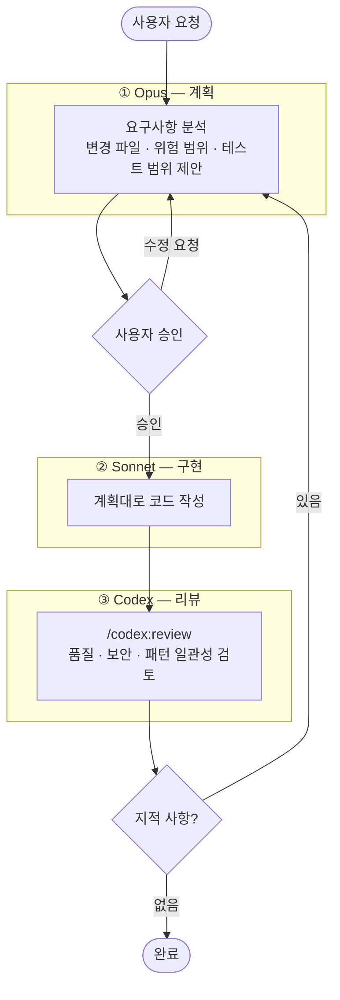

# Resume Router


회사별 맞춤 이력서를 만들고 안정적인 공개 URL로 제공하는 Next.js 애플리케이션입니다.

공통 이력서를 유지하면서 회사별 자기소개와 지원동기만 따로 관리하고, 관리자 화면에서 Markdown으로 내보내 AI 피드백을 받을 수 있습니다.

- 기업별 이력서에 6자리 짧은 공개 URL 자동 부여 (`/resumes/AB12CD`)
- 관리자 Markdown 내보내기 → AI 피드백 루프
- 관리자 페이지 Basic Auth 보호

## 기술 스택

Next.js App Router · Prisma · SQLite · Docker

## 주요 경로

| 경로 | 설명 |
| --- | --- |
| `/resume` | 기본 이력서 공개 페이지 |
| `/resumes/[id]` | 기업별 이력서 공개 페이지 |
| `/admin/resumes` | 이력서 목록, 검색, URL 복사, 수정, 삭제 |
| `/admin/profile` | 공통 이력서 수정 |
| `/admin/resumes/new` | 기업별 이력서 생성 |

## 사용 흐름

1. `/admin/profile`에서 공통 이력서를 입력합니다.
2. `/admin/resumes/new`에서 회사명, 기업별 자기소개, 지원동기를 입력합니다. 저장 시 6자리 공개 ID가 자동 생성됩니다.
3. `/admin/resumes`에서 공개 URL을 복사해 지원서나 채용 플랫폼에 공유합니다.
4. 필요하면 Markdown으로 내보내 AI 도구에 붙여 넣고 피드백을 받습니다.

## 로컬 실행

```bash
npm install
npm run db:push
npm run db:seed
npm run dev
```

## Docker 실행

```bash
docker compose up --build
```

기본 포트는 `3000`입니다. `docker-compose.yml`은 호스트의 `./data` 디렉터리를 컨테이너의 `/app/data`에 마운트해 SQLite 파일이 컨테이너 재생성 후에도 유지됩니다.

## 셀프 호스팅 배포

`main` 브랜치에 푸시하면 홈서버의 GitHub Actions self-hosted runner가 Docker 이미지를 빌드하고 컨테이너를 재시작합니다. DB 스키마 마이그레이션(`prisma db push`)은 컨테이너 시작 시 자동 실행됩니다.

### 1. Runner 설치

홈서버에 Docker와 Docker Compose 플러그인을 설치한 뒤, GitHub 저장소의 **Settings → Actions → Runners → New self-hosted runner**에서 안내하는 설치 명령을 실행합니다.

### 2. 데이터 디렉터리 및 환경변수 (1회)

영속 데이터는 runner 워크스페이스 밖의 고정 경로에 보관합니다.

```bash
sudo mkdir -p ~/resume-router/data
sudo chown -R "$USER":"$USER" ~/resume-router
```

`~/resume-router/.env`를 생성합니다.

```env
DATABASE_URL="file:/app/data/dev.db"
BASE_URL="https://resume.example.com"
ADMIN_USERNAME="admin"
ADMIN_PASSWORD="change-this-to-a-long-random-password"
RESUME_ROUTER_DATA_DIR="~/resume-router/data"
```

`DATABASE_URL`은 컨테이너 내부 경로로 고정합니다. 호스트의 실제 SQLite 파일 위치는 `RESUME_ROUTER_DATA_DIR`로 지정합니다.

### 3. 기존 데이터 이전

이전 경로에서 운영하던 DB가 있다면 이동합니다.

```bash
mv /기존/경로/data/dev.db ~/resume-router/data/dev.db
```

### 수동 배포

runner 없이 수동으로 배포하려면 프로젝트 디렉터리에서 실행합니다.

```bash
docker compose --env-file ~/resume-router/.env up -d --build
```

## AI 개발 워크플로

기능 추가나 수정은 3-에이전트 플로우로 진행합니다. 상세 기준은 [WORKFLOW.md](./WORKFLOW.md)를 참고합니다.


